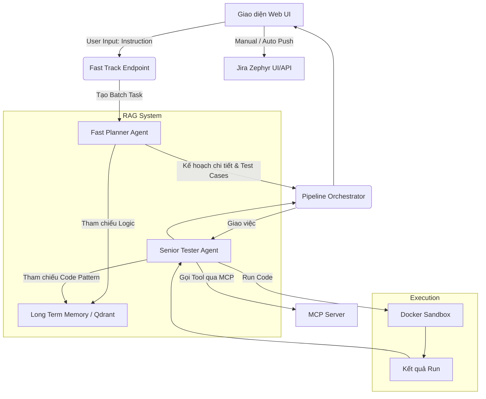

<div align="center">

# 🤖 NCPP Auto-QA Multi-Agent System (QC Agent)

**Nền tảng Tự động hóa Kiểm thử Thông minh dựa trên Kiến trúc Đa Đặc vụ (Multi-Agent), RAG và Model Context Protocol (MCP).**

[](https://www.python.org/downloads/)
[](https://www.docker.com/)
[](https://playwright.dev/)
[](https://www.atlassian.com/software/jira)
[]()

---

</div>

<details>
  <summary><b>📚 Nội dung (Table of Contents)</b></summary>

1. [Tổng quan Dự án (Project Overview)](#1-tổng-quan-dự-án-project-overview)
2. [Tính năng Hiện tại (Current Features)](#2-tính-năng-hiện-tại-current-features)
3. [Công nghệ Sử dụng (Tech Stack)](#3-công-nghệ-sử-dụng-tech-stack)
4. [Kiến trúc Hệ thống (System Architecture)](#4-kiến-trúc-hệ-thống-system-architecture)
5. [Hướng dẫn Bắt đầu (Getting Started)](#5-hướng-dẫn-bắt-đầu-getting-started)
6. [Sử dụng (Usage)](#6-sử-dụng-usage)
7. [Cấu trúc Thư mục (Project Structure)](#7-cấu-trúc-thư-mục-project-structure)
8. [Lưu ý về Code Cũ (Legacy Code)](#8-lưu-ý-về-code-cũ-legacy-code)

</details>

---

## 1. Tổng quan Dự án (Project Overview)

**Auto-QA Multi-Agent System (QC Agent)** là giải pháp kiểm thử tự động toàn diện được thiết kế để thay thế các quy trình QA thủ công truyền thống. 

Hiện tại, hệ thống tập trung vào luồng máy chủ **Web Dashboard (Kiến trúc "Kinetic Intelligence")** kết hợp với luồng **Fast Track Neural Pipeline**. Thay vì yêu cầu người dùng cấu hình phức tạp qua terminal, hệ thống cung cấp giao diện trực quan để người dùng nạp tài liệu dự án (RAG), chỉ định kịch bản kiểm thử, sau đó AI sẽ tự động phân tích, đóng vai trò một SDET (Software Development Engineer in Test) để sinh mã automation Playwright, chạy thử trong môi trường Sandbox, và xuất kết quả trực tiếp lên Jira Zephyr Scale.

## 2. Tính năng Hiện tại (Current Features)

Dự án hiện tại tập trung vào các tính năng lõi sau:

1. **Giao diện Web Trực quan (Synthetic Architect Dashboard):** Bảng điều khiển trung tâm quản lý toàn bộ vòng đời kiểm thử, từ nạp tài liệu, giám sát tiến trình Agent, đến đồng bộ kết quả.
2. **Fast Track SDET Pipeline:** Luồng xử lý tiên tiến với hai nhân tố AI chính:
   - **Fast Planner Agent:** Lên phương án chiến lược, băm nhỏ yêu cầu thành các Test Case.
   - **Senior Tester Agent:** Viết Forensic Script (kịch bản bằng lời) và Neural Automation (mã Playwright bằng Python/TS) cho từng phần.
3. **Memory Hub (RAG Integration):** Tích hợp Vector DB (Qdrant) để lưu trữ và truy xuất siêu tốc tài liệu dự án (File Text, PDF, URL, Docs). AI đọc tài liệu nội bộ trước khi lên kịch bản kiểm thử để đảm bảo tính chính xác cao.
4. **Tích hợp Native với Jira Zephyr Scale:** Khả năng tự động Push hàng loạt (Bulk Push) hoặc đẩy thủ công (Manual Push) kết quả thực thi (Pass/Fail, Logs, mã Code) lên Jira Zephyr.
5. **Môi trường Sandbox Cách ly:** Chạy lệnh tự động hóa Playwright an toàn tuyệt đối trong Docker Containers thay vì chạy trực tiếp trên máy chủ (`sandbox_docker.py`).
6. **Model Context Protocol (MCP):** Hỗ trợ Agent tương tác với Browser, File System, và các lệnh hệ thống thông qua chuẩn MCP mở của ngành.

## 3. Công nghệ Sử dụng (Tech Stack)

| Lớp (Layer) | Công nghệ | Lý do áp dụng |
| :--- | :--- | :--- |
| **Giao diện Web** | `Flask` & `Vanilla JS/TailwindCSS` | Vận hành nhẹ nhàng, kết nối Async/Sync mượt mà. |
| **Hệ sinh thái AI** | `Python 3.10+`, `FPT Cloud LLM` | Sử dụng các Model mạnh như Qwen3-32B để tư duy. |
| **RAG / Memory** | `Qdrant`, `multilingual-e5-large` | Quản lý Vector DB tại chỗ siêu tốc. |
| **Automation** | `Playwright` | Thư viện điều khiển Browser E2E chuẩn xác nhất hiện nay. |
| **Thực thi An toàn** | `Docker` Sandbox | Đóng gói môi trường thực thi automation, tránh rủi ro bảo mật. |
| **Giao tiếp Công cụ**| `MCP` (Model Context Protocol) | Chuẩn giao tiếp kết nối AI và Tool Servers (Browser, CLI). |

## 4. Kiến trúc Hệ thống (System Architecture)

Luồng thực thi hiện tại (Fast Track Flow):



### Chi tiết các thành phần:

*   **Giao diện Web UI (Dashboard):** Điểm tiếp nhận yêu cầu (Instruction) và hiển thị tiến trình, quản lý bộ nhớ RAG và đồng bộ Jira.
*   **Fast Track Endpoint:** Trung tâm xử lý Backend, khởi tạo luồng "Neural Pipeline" và quản lý trạng thái Batch Task.
*   **Fast Planner Agent:** Agent lập kế hoạch, có nhiệm vụ "băm" yêu cầu thô thành các Test Cases chi tiết và kế hoạch thực hiện.
*   **RAG System (Long Term Memory):** Hệ thống tri thức dựa trên Qdrant, cung cấp tài liệu nghiệp vụ (SRS/PRD) và Code Patterns cho Agent.
*   **Pipeline Orchestrator:** "Nhạc trưởng" điều phối, chuyển giao nhiệm vụ từ Planner sang cho Senior Tester thực thi.
*   **Senior Tester Agent:** Agent SDET AI chuyên trách viết Forensic Script (kịch bản lời) và Neural Automation (mã Playwright).
*   **MCP Server (Model Context Protocol):** Giao thức kết nối giúp AI có "đôi tay" để tương tác với Trình duyệt, File System và CLI.
*   **Execution (Docker Sandbox):** Môi trường thực thi mã an toàn trong Container, cách ly hoàn toàn với hệ thống máy chủ.
*   **Jira Zephyr UI/API:** Điểm cuối cùng lưu trữ Test Case và kết quả thực thi (Pass/Fail) đồng bộ sang hệ thống quản lý kiểm thử.


## 5. Hướng dẫn Bắt đầu (Getting Started)

### 5.1 Pre-requisites (Yêu cầu hệ thống)
* Python 3.10+
* Đã cài đặt Docker (nếu muốn bật Sandbox mode)
* Key API LLM (Ví dụ: OpenAI hoặc FPT Cloud)
* Thông tin kết nối Jira (Username, API Token, URL)

### 5.2 Cài đặt

**Bước 1:** Clone mã nguồn dự án:
```bash
git clone <repo-url>
cd qc-agent-master
```

**Bước 2:** Cài đặt thư viện:
```bash
python -m venv venv
venv\Scripts\activate   # Trên Windows
# source venv/bin/activate # Trên Linux/Mac
pip install -r requirements.txt
```

**Bước 3:** Thiết lập `.env` (Sử dụng config):
Tạo file `.env` tại thư mục root:
```env
FPT_API_KEY=your_key...
JIRA_SERVER_URL=https://your-domain.atlassian.net
JIRA_USERNAME=your.email@domain.com
JIRA_API_TOKEN=your-jira-api-token

# Cấu hình Vector DB (Chạy Local Memory)
VECTOR_DB_URL=http://localhost:6333
```

## 6. Sử dụng (Usage)

Khác với phiên bản cũ chạy qua Terminal, dự án hiện tại thao tác chính trên Web UI:

**Bật hệ thống Backend & Dashboard:**
```bash
python web_ui/server.py
```

Truy cập địa chỉ hiển thị trên Terminal (ví dụ: `http://localhost:5001`), bạn sẽ thấy Dashboard **Synthetic Architect**.

- **Memory Hub:** Cho phép bạn dán tài liệu (PRD, SRS, Text, file code) để AI "tiêu hóa" vào Vector DB.
- **Fast Track:** Nhập yêu cầu kịch bản Test, điền Jira Cycle ID / Project ID. Bấm "Execute Neural Pipeline", AI sẽ tự động phân tích và sinh ra Code Automation.
- **Push To Jira:** Tại tab kết quả Fast Track, tick chọn các Test Case và nhấn "Push Selected to Jira" để đẩy test case mới tạo hoặc kết quả pass/fail lên hệ thống Zephyr Scale của Jira.

Tất cả log, kịch bản (TS/PY), và ảnh chụp màn hình đều lưu tại thư mục `tmp/` ở thư mục gốc của dự án.

## 7. Cấu trúc Thư mục Hiện tại (Project Structure)

```text
qc-agent-master/
├── web_ui/
│   ├── server.py             # Entrypoint CHÍNH của hệ thống thời điểm hiện tại
│   └── index.html            # Frontend Dashboard
├── fast_track_endpoint.py    # Luồng Fast Track xử lý chính
├── src/
│   ├── agent/
│   │   ├── fast_planner.py   # Agent AI Lập kế hoạch theo luồng Fast Track
│   │   ├── senior_tester.py  # Agent AI Sinh mã Code Automation
│   │   └── agent.py          # Abstract Base Class cho Agents
│   ├── memory/
│   │   ├── longterm_memory.py# Cơ chế RAG (Vector DB Integration)
│   │   └── shared_memory.py
│   ├── utils/
│   │   ├── jira_client.py    # Giao tiếp với API Jira Zephyr Scale
│   │   └── sandbox_docker.py # Module chạy code trong container an toàn
│   └── config/               # Cấu hình tĩnh và Model setup
├── tmp/                      # Chứa mã nguồn sinh ra, logs, ảnh chụp màn hình
├── .env                      # File chứa khóa API và thông tin nhạy cảm
├── requirements.txt
└── README.md
```

## 8. Lưu ý về Code Cũ (Legacy Code)

Dự án này đã trải qua quá trình tiến hóa để trở nên tinh gọn và chính xác hơn. Do đó, có một số thư mục và file **không còn được sử dụng tích cực** nhưng vẫn được giữ lại để đối chiếu:

- Tuệ nhân tạo theo đội nhóm cũ tại: `src/agent/qcteam/` (Bao gồm Orchestrator, Verifier, Executor cũ). Luồng này trước đây dùng nhiều LLM calls rườm rà và đã được thay thế hoàn toàn bởi `Fast Track Pipeline`.
- Script chạy CLI cũ `src/app_test_cycle.py`: Công cụ cũ để đọc test cycle tuần tự từ Jira. Hiện tại Web Dashboard xử lý toàn vẹn hơn và cho phép người dùng kiểm soát linh hoạt.
- Một số modules sinh báo cáo TXT cũ (hiện đẩy trực tiếp vào UI).

<div align="center">
  <i>Được thiết kế để rút ngắn 80% thời gian thực thi Kiểm thử tự động.</i>
</div>