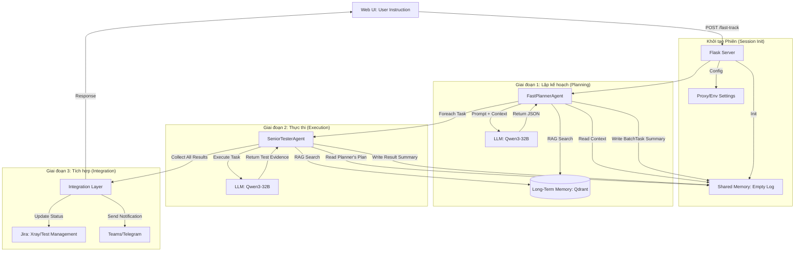

# Đặc tả Luồng dữ liệu Fast Track (Fast Track Data Flow)

Tài liệu này mô tả chi tiết luồng dữ liệu, cách thức hoạt động của bộ nhớ (Memory) và các công cụ (Tools) trong quy trình **Fast Track Testing**.

## 1. Sơ đồ luồng (Data Flow Diagram)

---

## 2. Chi tiết các thành phần

### A. Hệ thống Bộ nhớ (Memory System)
1.  **Shared Memory (Bộ nhớ chia sẻ - Ngắn hạn)**:
    *   **Cơ chế**: Dựa trên lớp `SharedMemory` (sử dụng `deque` để lưu trữ log trong RAM).
    *   **Vai trò**: Là cầu nối "tức thời" giữa các Agent. 
    *   **Dữ liệu**: Planner ghi lại kế hoạch tổng thể; Senior Tester ghi lại kết quả từng task.
    *   **Lợi ích**: Giúp Worker Agent hiểu được bối cảnh mà Planner đã đặt ra mà không cần truyền tham số phức tạp.

2.  **Long-Term Memory (Bộ nhớ dài hạn - RAG)**:
    *   **Cơ chế**: Sử dụng **Qdrant Vector Database**.
    *   **Vai trò**: Cung cấp kiến thức nền tảng (SRS, tài liệu kỹ thuật, quy định test).
    *   **Dữ liệu**: Được nhúng (embedded) bằng model `text-embedding-3-small`.

### B. Công cụ và Kết nối (Tools & Connectivity)
1.  **LLM Call (Direct Requests)**:
    *   Không sử dụng SDK OpenAI để tránh lỗi phụ thuộc.
    *   Sử dụng thư viện `requests` gọi trực tiếp đến Gateway của **FPT Cloud**.
    *   Tự động xử lý cấu hình Proxy (`HTTP_PROXY`) và ngoại lệ nội bộ (`NO_PROXY`).

2.  **External Integrations**:
    *   **Jira Tool**: Tự động cập nhật `Test Cycle` dựa trên kết quả cuối cùng (`PASS`/`FAIL`).
    *   **Comms Tool**: Định dạng kết quả dưới dạng Markdown đẹp mắt để gửi qua ứng dụng nhắn tin.

### C. Luồng dữ liệu (Data Pipeline)
1.  **Input**: Câu lệnh tự nhiên (ví dụ: "Kiểm tra tính năng đăng nhập").
2.  **Context Assembly**: `MemoryManager` tổng hợp dữ liệu từ cả 2 lớp bộ nhớ (LTM + SM) thành một Prompt siêu ngữ cảnh.
3.  **Output**: Kết quả Test Case, bằng chứng (Evidence) và link Jira trực tiếp trên giao diện Web.

---

## 3. Các thực thể chính (Key Classes)
*   `SharedMemory`: Lưu trữ nhật ký chung.
*   `MemoryManager`: Lắp ráp Prompt thông minh (RAG + History + Shared Log).
*   `FastPlannerAgent`: Chia nhỏ yêu cầu phức tạp thành các task đơn giản.
*   `SeniorTesterAgent`: Thực thi chuyên môn và tạo bằng chứng test.
