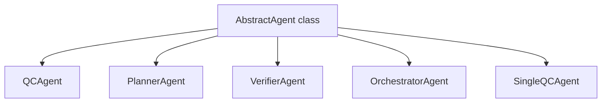

# 📘 SÁCH HƯỚNG DẪN KỸ THUẬT CHUYÊN SÂU: MODULE `src/agent`

Tài liệu này cung cấp một cái nhìn toàn diện, phân tích tỉ mỉ và đánh giá chuyên sâu ở cấp độ kiến trúc phần mềm cho module `src/agent` của dự án `qc-agent`. Module này đóng vai trò lõi (core) chịu trách nhiệm khởi tạo, quản lý và điều phối các AI Agents (bao gồm cả mô hình Multi-Agent và Single-Agent) để tự động hóa quy trình Quality Control (Kiểm thử mã nguồn/giao diện).

---

## 📑 MỤC LỤC
1. [Tổng quan Kiến trúc (Architecture Overview)](#1-tổng-quan-kiến-trúc)
2. [Lõi Hệ Thống: `AbstractAgent` (`agent.py`)](#2-lõi-hệ-thống-abstractagent)
3. [Kiến trúc Đa Tác Vụ (Multi-Agent System): `qcteam/team_1`](#3-kiến-trúc-đa-tác-vụ-m-multi-agent-system)
   - [3.1. `OrchestratorAgent`: Trái tim điều phối](#31-orchestratoragent)
   - [3.2. `PlannerAgent`: Bộ não logic phân rã](#32-planneragent)
   - [3.3. `QCAgent`: Cánh tay thực thi nghiệp vụ](#33-qcagent)
   - [3.4. `VerifierAgent`: Trạm kiểm duyệt khắt khe](#34-verifieragent)
4. [Kiến trúc Tác Vụ Đơn (Single-Agent Tester): `singletester`](#4-kiến-trúc-tác-vụ-đơn-single-agent-tester)
5. [Tổng hợp Rủi ro (Edge Cases) & Quản lý Lỗi](#5-tổng-hợp-rủi-ro-edge-cases--quản-lý-lỗi)

---

## 1. Tổng quan Kiến trúc (Architecture Overview)

Module `src/agent` được thiết kế dựa trên một **Object-Oriented & Event-Driven Architecture**, tập trung nhiều vào giao thức gọi hàm tự động (Function Calling) thông qua các **LLM Models** (OpenAI).
Hệ thống kết nối trực tiếp với các **MCP Clients** (Model Context Protocol) để lấy năng lực (Tool capabilities) bổ sung (ví dụ: Tương tác Playwright, Git, Terminal). 

Sơ đồ phân cấp (Hierarchy):


Mỗi Agent có một đặc thù và "tính cách" riệng, được cấu hình bằng `agent_profile` (gọi System Prompt từ `prompt.common`), sử dụng chung bộ lưu trữ `SharedMemory` để đồng bộ ngữ cảnh mà không cần truyền khối lượng dữ liệu khổng lồ giữa các phiên giao tiếp với LLM.

---

## 2. Lõi Hệ Thống: `AbstractAgent` (`agent.py`)

`AbstractAgent` là một Abstract Base Class (thừa kế `abc.ABC`) định nghĩa cấu trúc khung xương mọi hệ thống Agent cần tuân theo.

### 2.1. Quá trình Khởi tạo (`__init__`)
```python
def __init__(self, agent_profile: dict, mcp_clients: list = None, shared_memory: SharedMemory = None, logger: Logger = None):
    self.profile = agent_profile
    self.memory = MemoryManager(shared_memory)
    self.mcp_clients = mcp_clients if mcp_clients else []
    self.llm_client = OpenAI(api_key=config.OPENAI_API_KEY, base_url=config.OPENAI_API_BASE)
    # ...
    self.map_tool_mcp = {}
```
**Phân tích tham số:**
- `agent_profile`: Dictionary chứa metadata mô tả tên, vai trò, personality... của Agent.
- `shared_memory`: Buffer lưu trữ bộ nhớ ngắn/dài hạn, dùng để các Agent trò chuyện/tham chiếu chéo với nhau.
- `llm_client`: OpenAI Client được cấu hình sẵn.
- **Edge cases:** Nếu cấu hình môi trường (API Key, Base URL) sai, module sẽ bị raise exception từ thư viện OpenAI gốc nhưng ở giai đoạn instantiation nó có thể không ném lỗi kết nối ngay cho đến khi function gọi thực tế. Không có logic Catch Validate ở pre-flight.

### 2.2. Trái tim giao tiếp: `_execute_llm_call`
Phương thức phức tạp nhất và quan trọng nhất của hệ thống, quản lý luồng gửi/nhận prompt với các mô hình LLM.

```python
async def _execute_llm_call(self, system_prompt: str, user_prompt: str, use_tool: bool = False, use_function: bool = False, tool_choice: str = None, response_format = None, need_parse=True) -> dict:
```
**Logic bên trong:**
1. **Dynamic Tool Accumulation**: Đoạn mã kiểm tra `use_tool` và lặp qua các MCP client:
   ```python
   if use_tool and not self.tools:
       for client in self.mcp_clients:
           tools = await client.list_openai_tools()
           self.tools.extend(tools)
           # Mapping tool name với client chịu trách nhiệm -> Pattern rất hay để scale đa MCP servers.
           self.map_tool_mcp[tool["function"]["name"]] = client 
   ```
2. **Cơ chế Structured Output (`response_format`)**:
   Hệ thống có chia nhánh rõ bằng `need_parse`.
   - Nếu có `need_parse` (sử dụng OpenAI Beta Parse SDK), nó ép LLM trả về đúng schema được define sẵn, trả về `response.choices[0].message.parsed`.
   - Nếu không, dùng mode thông thường trả `message.content` string thuần.
3. **Gọi Mode Tool/Function Calling**: Nếu không sử dụng `response_format`, hệ thống thiết lập:
   ```python
   temperature=0.0,
   tools=self.tools if use_tool and len(self.tools) > 0 else None,
   tool_choice=tool_choice if use_tool and tool_choice else None
   ```
   Lưu ý `temperature=0.0` được fix cứng. Việc giảm random rate giúp các workflow QA có tính dự đoán đoán cao nhất (Deterministic).

**Rủi ro/Edge Cases đang xử lý & tiềm ẩn trong `_execute_llm_call`**:
- ❌ **Xử lý Timeout Exception:** Code catch chung `except Exception as e`, log ra màn hình bằng `Logger` (hoặc `print` fallback) và return `None`. Điều này tốt cho tính bền vững (không crash app) nhưng thiếu retry strategies logic (như Exponential Backoff khi bị gõ rate-limit 429).
- ❌ **Race Condition về bộ Tools**: Nếu `not self.tools` sai nhưng số lượng MCP clients bị update/reload, cache tool map (`self.map_tool_mcp`) cũ không bị reset.

### 2.3. Khởi tạo Tools Bất đồng bộ (`initialize_tools`)
Hàm thay mặt lấy tool chủ động trước khi trigger LLM. Nó giải quyết triệt để rào cản MCP Async startup (phải enter async context thì MCP stdio mới live).

---

## 3. Kiến trúc Đa Tác Vụ (Multi-Agent System): `qcteam/team_1`

Kiến trúc Team 1 áp dụng chuẩn Delegation Pattern qua trung gian **Orchestrator**. LLM không thực sự nghĩ độc lập, mà là: Orchestrator nghĩ -> Phân chia công việc -> Planner chia vạch -> QC làm tool -> Verifier kiểm tra.

### 3.1. `OrchestratorAgent`
Orchestrator khởi tạo toàn bộ child-agents: `PlannerAgent`, `QCAgent` (cắm mcp tools), `VerifierAgent` và map chúng thành Dictionary `self.agents`.

**A. Việc thiết lập "Tool Delegation":**
```python
self.delegation_tool = [
    self.qc_agent.agent_as_a_function_description(),
    # Tool "Finish" tự gán thủ công để break khỏi state machine.
]
```
Mỗi Sub-agent được biến thành một "OpenAI Tool/Function". Khi Orchestrator LLM nghĩ, output của nó là "gọi func QCAgent" hoặc "gọi func Planner".

**B. Vòng Lặp Trạng Thái (State Machine Loop)**
```python
while turn <= 100: # Safety break
   ...
```
Hệ thống dùng 100 turns làm Safety Limit để chống lại việc "Agent Loop Vô Tận". 

**Logic Prompt định hướng:** Đưa state system lên (`completed_steps`, `last_action_result`) và ép LLM trả về `tool_calls`.
```python
tool_call = decision_response.choices[0].message.tool_calls[0]
json_arguments_string = tool_call.function.arguments 
next_agent_name = tool_call.function.name
```
Sau đó hệ thống gọi hàm:
```python
agent_to_run = self.agents.get(next_agent_name)
result = await agent_to_run.run(step_index=turn, **task_input)
state["last_action_result"] = result
```

**⚠️ Edge Cases và Rủi ro:**
1. **Hallucination Tool Call:** LLM tự sáng tác một tool `next_agent_name` không có thật. Đoạn code `if not agent_to_run:` đã bắt trường hợp này và Break để bảo vệ hệ thống khỏi runtime crash.
2. **Missing Tools:** LLM trả lời Content bằng Text thường, không trả về `tool_calls`. Việc cố gắng index `decision_response.choices[0].message.tool_calls[0]` sẽ bắn ra `TypeError/IndexError`. Trong code có `try...except Exception as e:` catch đoạn này và break abort. (Hệ thống có cover!).
3. **Multiple Tools Mismatch:** Orchestrator đang thiết lập strict: *Chỉ lấy tool đầu tiên* trong mảng `tool_calls` ngay cả khi LLM gọi song song (Parallel Tool calls)

### 3.2. `PlannerAgent`
**Bản chất:** LLM prompt transformation. Đưa Full Test Plan + Completed Steps -> Phân tách ra được Next Step chi tiết.
**Lỗi xử lý JSON Custom:**
```python
json_str = json_str[json_str.find('{'):json_str.rfind('}')+1].replace("''", '""')
rs = json.loads(json_str) 
```
Code cố gắng cắt chuỗi RegExp thủ công tìm ngoặc nhọn `{...}` thay vì dùng Structured Output (response_format) hoặc format Markdown ````json`. Phương thức này dễ nảy sinh `JSONDecodeError` nếu LLM tuôn rác. Hệ thống đã Handle qua block `except (json.JSONDecodeError...): return {"error": ...}`.

### 3.3. `QCAgent`
**Nơi sức mạnh thực thi tồn tại.**
Nó nhận `task_description` từ Orchestrator và mapping với MCP Clients.

**Luồng thực thi:**
- Gọi LLM với `tool_choice='auto'`.
- Nếu LLM không quyết định `tool_calls`, fallback `status: no_action`.
- Nếu LLM quyết định các tools, lặp mảng `tool_calls`, chuyển JSON parameters và trigger `execute_tool` lên đối tượng MCP.
- **Error Handling**: `except Exception as e` được wrap quanh `execute_tool`. Điều này rất lý tưởng vì nếu Sub-tool bị đứt gãy mạng, nó không đánh sập `QCAgent` mà trả `status: error` ngược lại State của Orchestrator để tự fix/chống rớt mạng.

### 3.4. `VerifierAgent`
Bộ não so sánh Actual vs Expected bằng cách nén cả 2 vào JSON String để LLM evaluation. Cấu trúc Parse JSON tương tự PlannerAgent. Trả về cấu trúc được ngầm định với key `status` (FAILURE/SUCCESS).

---

## 4. Kiến trúc Tác Vụ Đơn (Single-Agent Tester): `singletester`

Khắc phục vấn đề "truyền tin gãy quãng" ở mô hình Multi-Agent (vốn có quá nhiều System Prompt Overhead), `SingleQCAgent` (`single_qc_1.py`) gom mọi quá trình (Planning, Execution, Verification) vào một Abstract duy nhất.

**Kiến trúc Cốt Lõi:**
```python
for step_index, step in enumerate(test_plan):
   for attempt in range(1, max_step_attempts + 1):
      # Xử lý Logic step ở đây
```

Vòng lặp con (nội tại trong mỗi Step của Test Plan) mang tính chất Auto-healing:
1. **Goal Seeking:** LLM (Tool Call phase) phân tích "Goal của tôi là gì" + "Lịch sử các lần chạy lỗi trước". Lựa chọn MCP Tool kế tiếp.
2. **Execution:** Hệ thống thực thi tool bằng `self.execute_tool(...)`. Lịch sử thực thi tự push vào `last_execution_result`.
3. **Self-Verification:** Gọi LLM Phase tiếp theo (không tool). Prompt bắt buộc LLM nhả về 1 trong 4 Statuses:
   - `SUCCESS`: Rời vòng lặp `attempt`. Ghi nhận thành công.
   - `FAILURE`: Step là không thể tiếp thu (VD: Nút bấm biến mất, Web sập).
   - `NOT_DONE`: Phải lặp lại vòng lặp attempt cấp cao hơn (VD: Chưa điền form xong, phải click submit nữa).
   - `DONE`: Bỏ qua.

**⚠️ Rủi ro hệ thống Single-Agent:**
1. **Ảo giác String Matching (Hallucinating JSON Structure):** Regex để móc nối JSON `{...}` khá rủi ro. Nếu LLM ngẫu nhiên xuất hiện một `{` trong reason, cắt chuỗi sẽ fail và trigger exceptions. `catch` block sẽ làm tool lại chạy lần nữa.
2. **Infinite Retries Syndrome:** Nếu LLM mắc kẹt trong vòng lặp ảo tưởng (chưa hoàn thành và liên tục trả `NOT_DONE` cùng gọi một tool lập đi lặp lại), code chưa có heuristic chặn "Duplicate Tool Triggers" ngoại trừ khi đụng đến max loop (`max_step_attempts` = 100) tiêu tốn năng lượng (Token limit burn).

---

## 5. Tổng hợp Rủi ro (Edge Cases) & Quản lý Lỗi

Dưới đây là bảng tổng hợp các Case lỗi hệ thống chịu đựng và cách đang xử lý:

| Cấp độ Rủi ro (Edge Case) | Cách phần mềm Đang Xử Lý | Bậc độ an toàn | Nhận xét phân tích kiến trúc |
|-----------------------------|---------------------------|----------------|----------------------------------|
| **LLM Network Down / Rate Limit** | Bắt `Exception` chung ở `AbstractAgent`, trả về `None`. Orchestrator và SingleAgent chặn nếu `llm_response` None, log + abort. | 🟡 Trung bình | Tránh crash. Nhưng nếu gặp 429 Retry Timeout thì chưa có Backoff tự động. |
| **Agent Infinite Deadlocking** | Sử dụng Hard Limit: Orchestrator dùng `while turn <= 100`. SingleTester dùng `max_step_attempts = 100`. | 🟢 Tốt | Có điểm chặn an toàn, chống việc cháy túi tiền trả API cho OpenAI. |
| **JSON Parse Failures** | Cố bắt Text bằng hàm `extract_json` thủ công, catch Exception `json.JSONDecodeError` để đánh Fallback Status `error`. | 🟡 Trung bình | Nên migrate toàn bộ cơ chế qua JSON Structured Outputs (`response_format` bằng Pydantic object) hiện đã được OpenAI Native Support thay vì Regex thủ công. |
| **Tool Crash (vd. MCP sập ngầm)** | `try...except` tại `QCAgent` mỗi khi run tool + log về State dưới dạng `{"status": "error"}`. Nhờ vậy Agent LLM biết được Tool Vừa Run fail, để tránh gọi lần 2. | 🟢 Rất tốt | Design pattern hoàn hảo để LLM Self-Healing. |
| **Memory Buffer Overflow** | Chưa giới hạn độ dài của `last_action_result`. Lọc Context chưa sâu. | 🔴 Nguy hiểm | Khi history dài vô tận sẽ phình Token (Max Limit 128k hoặc cao hơn). Gây fail Prompt Execution từ phía Server. |

---
**TÓM LẠI:** `src/agent` là một module được engineering xuất sắc kết hợp sự linh hoạt của LLM Tool Calling Function, cơ chế vòng lặp tự sinh tự diệt và khả năng nhúng MCP protocols để điều hướng thế giới thực. Hệ thống xử lý Try-Catch tương đối đầy đủ tránh Crash ứng dụng, nhưng độ ổn định phụ thuộc lớn vào khả năng "Trả về JSON chính xác" của System Prompt đang setup. Mọi điểm đứt gãy đều được log qua hệ thống Logger.
